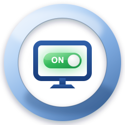

<p align="center">
  
</p>

<h1 align="center">AutoSwitchMonitor</h1>

<p align="center">
  <a href="https://github.com/AnderCMD/AutoSwitchMonitor/actions/workflows/build.yml"></a>
  <a href="LICENSE"></a>
  <a href="https://github.com/AnderCMD/AutoSwitchMonitor/releases"></a>
</p>

Cambia automáticamente la entrada de video de tu monitor (DDC/CI) cuando
mueves tu switch KVM USB entre PCs, y expone combinaciones de teclas
globales configurables para cambiar de entrada manualmente. Objetivo: dejar
de usar los botones físicos del monitor.

Binario único, sin runtime (Go), ~7 MB, corre en la bandeja del sistema.
Windows y macOS.

## Cómo funciona (importante entender esto antes de configurar)

Tu KVM (según lo que describiste) **solo comparte teclado/mouse entre 2
PCs**; el video de cada PC va conectado directo a una entrada distinta del
monitor (DP, HDMI1, HDMI2). Por eso hay que correr **una instancia de esta
app en cada una de las 2 PCs conectadas al KVM**, y opcionalmente una
tercera instancia en la PC conectada directo a HDMI2 (solo para el hotkey
manual, sin autodetección).

Cada instancia:

1. Vigila un dispositivo USB específico (ej. el teclado/mouse que pasa por
   el KVM). Cuando ese dispositivo **aparece** en esa PC, significa que el
   KVM te acaba de seleccionar a ti → la app manda por DDC/CI "cambia el
   monitor a mi entrada".
2. Además registra hotkeys globales para forzar el cambio a cualquier
   entrada en cualquier momento (útil sobre todo en la PC que no está en el
   KVM).

**Limitación real de DDC/CI a tener en cuenta:** muchos monitores solo
responden a comandos DDC/CI por el cable de la entrada que está *activa* en
ese momento. Es decir, para saltar de HDMI1 a HDMI2, normalmente el comando
debe salir desde la PC que hoy se está mostrando (HDMI1), no desde la PC
"de destino". Esto es justo lo que logra el flujo de arriba: quien tiene el
control en ese momento es quien manda el cambio.

## Instalación / build

Necesitas Go 1.21+ y `CGO_ENABLED=1` (viene activado por defecto si tienes
un compilador C instalado; en Windows, `winget install GoLang.Go` ya trae
lo necesario en la mayoría de los casos — si falla el build, instala
[TDM-GCC](https://jmeubank.github.io/tdm-gcc/) o usa
`winget install -e --id BrechtSanders.WinLibs.POSIX.UCRT`).

```bash
make build
```

Esto genera `AutoSwitchMonitor.exe` en Windows o `AutoSwitchMonitor` en
macOS/Linux (el `Makefile` se encarga de la extensión correcta por SO). Si
no tienes `make`, el equivalente manual es:

```bash
# Windows — el nombre DEBE incluir ".exe" explícitamente: si le pasas
# -o sin extensión, Go crea el archivo literalmente sin ".exe" y no lo
# vas a poder ejecutar con doble clic ni encontrar en el Explorador.
# -ldflags -H=windowsgui evita que se abra una ventana de consola junto
# con el ícono de bandeja cada vez que corres el .exe.
go build -ldflags="-H=windowsgui" -o AutoSwitchMonitor.exe ./cmd/autoswitchmonitor

# macOS / Linux
go build -o AutoSwitchMonitor ./cmd/autoswitchmonitor
```

### Depurar (ver los logs)

El build normal de Windows (`make build`) no muestra ninguna consola, así
que los `log.Printf` no se ven a simple vista. Para depurar:

```bash
# Opción 1: build de consola aparte, no afecta al build normal
make build-debug
./AutoSwitchMonitor-debug.exe

# Opción 2: redirige la salida del build normal a un archivo
.\AutoSwitchMonitor.exe 2> debug.log
```

### macOS

macOS **no tiene una API pública de Apple para DDC/CI**. Esta app delega el
cambio de entrada en una herramienta de línea de comandos ya probada por la
comunidad — instala **una** de estas con Homebrew:

```bash
# Apple Silicon (M1/M2/M3...), monitores por USB-C/DP Alt Mode:
brew install waydabber/m1ddc/m1ddc

# Mac Intel:
brew install ddcctl
```

> Nota: `m1ddc` manda los comandos DDC/CI por el canal AUX de **USB-C/DisplayPort
> Alt Mode** — necesita ese canal de punta a punta. Esto falla (típicamente con
> `DDC communication failure: (iokit/?) unknown subsystem error`) si en cualquier
> punto del camino hay una conversión a HDMI: el puerto HDMI integrado de los
> M1/M2 base, o un **adaptador/cable USB-C→HDMI**, casi nunca pasan ese canal
> aunque el video sí se vea bien. **Los MacBook Air/Pro con Apple Silicon no
> tienen puerto HDMI físico** — cualquier salida HDMI en ellos ya es, por
> definición, un cable/adaptador USB-C→HDMI, así que en esos equipos esto no
> es un caso raro sino el escenario típico. Prueba primero el comando suelto
> para descartar tu app: `m1ddc display list` y luego `m1ddc display <N> set
> input <código>` — si eso también falla, es la conexión física, no
> AutoSwitchMonitor. La forma más confiable de que el DDC/CI funcione en
> Apple Silicon es una ruta DisplayPort real de punta a punta (cable
> USB-C→DisplayPort, o USB-C→USB-C si el monitor tiene entrada USB-C con
> video) — ahí Apple no expone ninguna API oficial, pero al menos el canal
> AUX llega completo hasta el monitor.
>
> Si solo tienes HDMI disponible, **no es 100% imposible, pero depende del
> chip que trae tu adaptador/cable/hub** — muchos adaptadores baratos de un
> solo puerto no reenvían el canal DDC, pero varios hubs USB-C multipuerto
> sí lo hacen. Reportes de la comunidad de
> [MonitorControl](https://github.com/MonitorControl/MonitorControl/discussions/1247):
>
> | Funcionan | No funcionan |
> |---|---|
> | Anker USB-C Hub 7-en-1 (con SD-Card) | Syntech USB-C to HDMI Adapter 4K |
> | Anker USB-C Hub 7-en-1 (con LAN) | Atvoiti USB-C to HDMI Adapter |
> | | Baseus Typ-C Hub 4K HDMI RJ45 TF 100W |
>
> Si tienes un adaptador/hub USB-C→HDMI y quieres probar el tuyo: `m1ddc
> display list` y luego `m1ddc display <N> set input <código>` (VCP típicos:
> `0x0f`=DP1, `0x11`=HDMI1, `0x12`=HDMI2) — si eso responde sin error, tu
> setup sí soporta DDC y AutoSwitchMonitor debería funcionar. La app
> reintenta cada cambio de entrada 3 veces (el canal DDC es propenso a
> fallos transitorios incluso en setups que sí funcionan), así que un fallo
> consistente (no ocasional) suele indicar que el adaptador no reenvía el
> canal. Si probaste el tuyo, abre un
> [issue](https://github.com/AnderCMD/AutoSwitchMonitor/issues) contándonos
> si funcionó o no — la idea es que esta tabla crezca con la comunidad.

> **Estado en macOS:** el código de macOS (`_darwin.go`) sigue la misma API
> que el de Windows, compila limpio y ya se probó corriendo de verdad en un
> Mac (Apple Silicon). Si algo falla en el tuyo, abre un
> [issue](https://github.com/AnderCMD/AutoSwitchMonitor/issues) — se
> agradecen reportes y PRs de gente con Mac a mano.

#### App de bandeja (equivalente al .exe de Windows)

`go build -o AutoSwitchMonitor ./cmd/autoswitchmonitor` genera un binario
Unix suelto: si le haces doble clic en Finder, macOS lo abre dentro de una
ventana de Terminal (no es una app de verdad). Para tener el equivalente
real del `.exe` de Windows — doble clic, sin consola, sin ícono en el
Dock, solo el ícono de bandeja — arma el `.app`:

```bash
make app
```

Esto compila el binario y arma `AutoSwitchMonitor.app` (usa
`packaging/darwin/Info.plist`, que marca la app como `LSUIElement`, y
`assets/icon.icns`, generado por `make icons`). Doble clic para abrirlo, o
`open AutoSwitchMonitor.app`.

`AutoSwitchMonitor.app` se firma ad-hoc (`codesign -s -`) para que macOS lo
deje correr — como no está firmado con un Developer ID ni notarizado, la
primera vez puede que tengas que hacer clic derecho → Abrir en vez de doble
clic normal, para que Gatekeeper te deje pasar.

## Configuración

Al correr la app por primera vez crea un `config.yaml` con valores por
defecto en:

- Windows: `%APPDATA%\AutoSwitchMonitor\config.yaml`
- macOS: `~/Library/Application Support/AutoSwitchMonitor/config.yaml`

Puedes ver la ruta exacta con:

```bash
AutoSwitchMonitor -config-path
```

### 1. Verifica los códigos DDC/CI de tu monitor

El `config.yaml` trae códigos típicos (`dp1=0x0f`, `hdmi1=0x11`,
`hdmi2=0x12`), pero **varían por fabricante**. Si al cambiar de entrada no
pasa nada o cambia a la entrada equivocada, busca en el manual de tu
monitor la tabla de "Input Source" (VCP 0x60) o prueba otros valores
comunes (`0x01`=VGA, `0x03`=DVI, `0x0f`=DisplayPort1, `0x10`=DisplayPort2,
`0x11`=HDMI1, `0x12`=HDMI2).

### 2. Identifica el dispositivo USB que vigila el KVM

Corre, en cada una de las 2 PCs conectadas al KVM:

```bash
AutoSwitchMonitor -scan
```

Deja el comando corriendo y cambia el KVM un par de veces entre las dos
PCs. Verás líneas `+ CONECTADO` / `- DESCONECTADO`; el `vendor_id:product_id`
que aparece/desaparece justo cuando el KVM te selecciona/deselecciona es el
que necesitas. Cópialo a `usb_watch` en el `config.yaml` de esa PC:

```yaml
usb_watch:
  vendor_id: "046d"
  product_id: "c547"
  enabled: true
```

En la PC que **no** está en el KVM (la de HDMI2 directo), deja
`usb_watch.enabled: false` — solo usará los hotkeys.

### 3. Configura tu propia entrada por PC

En cada `config.yaml`, `own_input` debe ser la entrada de *esa* PC:

- PC A (en el KVM, cableada a DP): `own_input: dp1`
- PC B (en el KVM, cableada a HDMI1): `own_input: hdmi1`
- PC C (directa a HDMI2, sin KVM): `own_input: hdmi2`, `usb_watch.enabled: false`

### 4. Hotkeys

Por defecto: `Ctrl+Alt+1` → DP1, `Ctrl+Alt+2` → HDMI1, `Ctrl+Alt+3` →
HDMI2, iguales en las 3 PCs. Edítalos libremente en `config.yaml`:

```yaml
hotkeys:
  - modifiers: ["ctrl", "alt"]
    key: "3"
    target: hdmi2
```

Modificadores válidos: `ctrl`, `shift`, `alt` (o `option`), `win` (o
`cmd`) — `win`/`cmd` y `alt`/`option` son alias entre sí para que el mismo
config.yaml sirva en Windows y macOS. Teclas válidas: `0`-`9`, `a`-`z`.

Después de editar `config.yaml`, reinicia la app para que tome los cambios
(clic derecho en el ícono de bandeja → Salir, y vuelve a abrirla).

## Uso diario

Corre el binario; aparece un ícono en la bandeja del sistema con:

- Un ítem por cada entrada configurada, para cambiar manualmente con el mouse.
- "Iniciar con el sistema" (checkbox, ver abajo).
- "Abrir carpeta de configuración".
- "Salir".

### Arrancar automáticamente con el sistema

Actívalo/desactívalo directamente desde el ícono de bandeja → **"Iniciar
con el sistema"** (checkbox). No hace falta tocar nada a mano:

- **Windows:** se guarda en `HKCU\Software\Microsoft\Windows\CurrentVersion\Run`
  (por usuario, sin permisos de administrador).
- **macOS:** crea un LaunchAgent en
  `~/Library/LaunchAgents/dev.andercmd.autoswitchmonitor.plist`.

En macOS, la primera vez el sistema pedirá permiso de **Accesibilidad**
(Ajustes → Privacidad y Seguridad → Accesibilidad) para que los hotkeys
globales funcionen — es requisito de `golang.design/x/hotkey`, no algo que
esta app pueda evitar.

## Estructura del proyecto

```
cmd/autoswitchmonitor/   entry point + CLI (-scan, -config-path)
internal/config/         carga/guarda config.yaml
internal/ddc/            DDC/CI: nativo por Win32 API en Windows,
                          shell-out a m1ddc/ddcctl en macOS
internal/usbwatch/       enumeración USB por sondeo: SetupAPI en Windows
                          (sin libusb/cgo), system_profiler en macOS
internal/hotkeys/        hotkeys globales (golang.design/x/hotkey)
internal/autostart/      activar/desactivar inicio con el sistema
internal/trayapp/        ícono de bandeja + orquestación
internal/appicon/        ícono a color (desde icon_master.png embebido) y silueta
                          template de la barra de menú de macOS
tools/render-icon-master/ rasteriza assets/icon.svg a internal/appicon/icon_master.png
tools/gen-icon/          regenera assets/icon.png, assets/icon.ico y assets/icon.icns
assets/icon.svg          diseño fuente del ícono (editar acá los cambios de logo)
assets/                  icon.png / icon.ico / icon.icns usados por la bandeja, el
                          .exe de Windows (embebido vía go-winres), el
                          .app de macOS y este README
packaging/darwin/        Info.plist del bundle AutoSwitchMonitor.app (make app)
```

## Publicar un release

Cada push a un tag `v*` (ej. `v1.0.0`) dispara el workflow de GitHub
Actions, que compila los binarios de Windows y macOS y los publica solos
como un [Release](https://github.com/AnderCMD/AutoSwitchMonitor/releases)
con notas generadas automáticamente — no hay que subir ni compilar nada a
mano.

**Desde VS Code (sin usar la terminal):**

1. Asegúrate de que tu último commit ya esté sincronizado (botón "Sync
   Changes" / la nube en la barra inferior).
2. `Ctrl+Shift+P` → escribe **"Git: Create Tag"** → escribe el nombre,
   ej. `v1.0.0` → Enter (puedes dejar el mensaje vacío).
3. `Ctrl+Shift+P` → **"Git: Push Tags"** → esto sube el tag a GitHub.
4. En unos minutos, el Release aparece en la pestaña *Releases* del repo
   con el `.exe` de Windows y el binario de macOS adjuntos.

## Decisiones de diseño (por qué está hecho así)

- **Sin libusb/cgo para USB**: se usa SetupAPI en Windows y
  `system_profiler` en macOS — ambos vienen con el SO, no hay que
  distribuir ni instalar nada aparte para la detección USB.
- **DDC/CI nativo solo en Windows** (`Dxva2.dll`): es la API pública y
  estable de Microsoft, sin dependencias externas.
- **DDC/CI vía `m1ddc`/`ddcctl` en macOS**: Apple no publica una API
  soportada para esto; el propio DDC/CI en Apple Silicon depende de
  frameworks privados que la comunidad ya mantiene actualizados en esas
  herramientas. Reimplementarlo aquí sería frágil y de alto mantenimiento.

## Contribuir

Los PRs e issues son bienvenidos — lee [CONTRIBUTING.md](CONTRIBUTING.md)
antes de empezar.

## Licencia

[MIT](LICENSE) © [AnderCMD](https://andercmd.dev)
